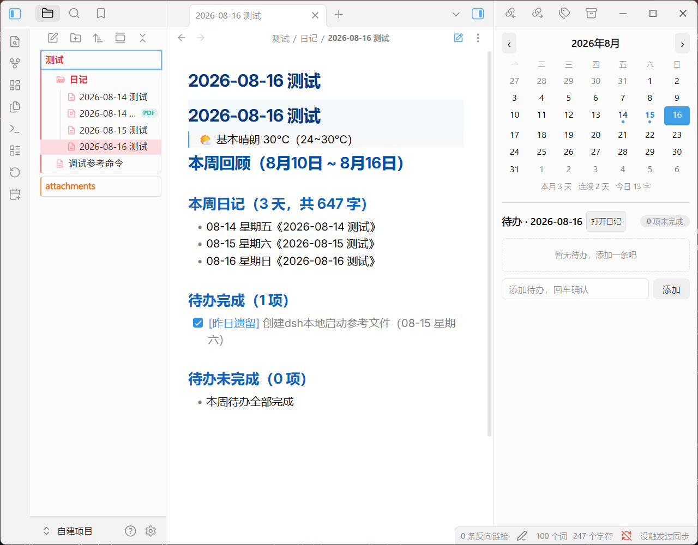
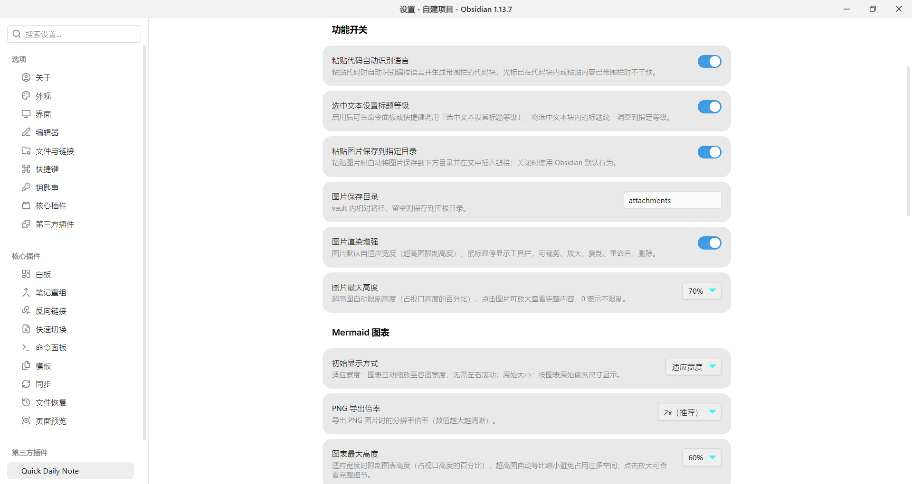
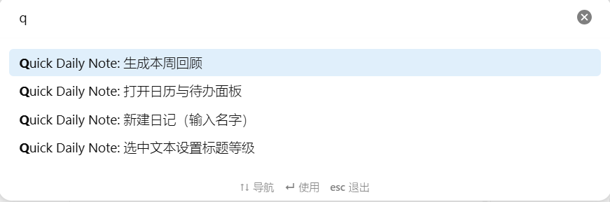

# Quick Daily Note 快捷日记

**English** | [简体中文](README.zh-CN.md)

A daily-journal and todo companion plugin for Obsidian: one-click daily notes, a calendar panel with per-day todos, scheduled reminders, and paste/rendering enhancements.

## Features

### 📝 Daily Notes
- Click the calendar icon in the ribbon, or run the command "New daily note (enter name)" to create a note titled "date + name" — the folder and date format are configurable. If a note with the same name exists, it opens directly.
- In the sidebar calendar panel, double-click a date to open or create that day's note.

### ✅ Calendar & Todos
- The calendar panel manages todos per day: add with the input box (Enter), check off, double-click to edit text, ✎ to modify, × to delete.
- When yesterday has unfinished todos, a "Carry over to today" banner appears at the top — one click moves them to today, marked as "carried over".
- Below the calendar: stats for this month's diary days, consecutive diary days, and today's word count.

### ⏰ Reminders
- Scheduled prompts to add a todo, or to check the day's unfinished todos; clicking the notification opens the calendar panel.

### 📊 Weekly Review
- The command "Generate weekly review" summarizes the week's diaries (days, word count, titles) and completed/uncompleted todos into Markdown, inserted at the cursor.

### ⌨️ Paste Enhancements
- Auto-detect the language of pasted code (30+ languages, zero dependencies) and wrap it in a fenced code block; plain text, single-line weak matches, and pastes inside code blocks are left alone.
- Optionally save pasted images into a configurable folder (vault-relative path; empty = vault root) and insert the link at the cursor (off by default).
- **File explorer paste** — copy/cut files in the sidebar file explorer with `Ctrl/Cmd+C` / `Ctrl/Cmd+X`, then paste them into a target folder with `Ctrl/Cmd+V` (VS Code style, toggleable).

### 🖼️ Image Enhancements
- Images fit the note width automatically; overly tall images are height-limited.
- Hover a rendered image for a toolbar: crop, zoom, copy, rename, delete (deleting also removes the references in notes and moves the file to the system trash).
- Click an image to view it enlarged, with crop and other actions in the modal toolbar.

### 📈 Mermaid Enhancements
- Diagrams fit the container width (or render at original size), with a configurable height limit for tall diagrams.
- Toolbar on the diagram: zoom in/out, reset, download as SVG or PNG (export scale configurable).
- Diagrams adapt to the page width when printing or exporting to PDF — never clipped.

### 🌤️ Weather Recording
- When enabled, the current day's weather is fetched and written below the note title after creating a daily note (data from Open-Meteo, no API key; failures never block note creation).

### 🖼️ App Background
- Set the whole interface background to a custom image or video from your vault — videos (mp4/webm/ogv) play as a dynamic wallpaper — with full adjustments: opacity, blur, brightness, contrast, position, scale and fit mode.

## Screenshots





## Installation

### Community Plugin Browser (once listed)
Settings → Community plugins → Browse, then search for **Quick Daily Note**.

### BRAT (before listing)
1. Install the [BRAT](obsidian://show-plugin?id=obsidian42-brat) plugin.
2. Run the command `BRAT: Add a beta plugin for testing` and enter `456-77/quick-daily-note`.
3. Enable Quick Daily Note.

### Manual Install
Download the latest release from GitHub, and copy `main.js`, `manifest.json`, and `styles.css` into `<vault>/.obsidian/plugins/quick-daily-note/`, then enable the plugin in Settings.

## Usage

### Commands

| Command | Description |
| --- | --- |
| New daily note (enter name) | Create a note titled "date + name"; opens the existing note if present |
| Open calendar & todo panel | Open the calendar and todo panel |
| Set heading level for selection | Normalize headings in the selected text block (toggleable in settings) |
| Generate weekly review | Summarize the week's diaries and todos at the cursor |

### Image Toolbar Buttons

| Button | Action |
| --- | --- |
| ✂ | Crop |
| ⛶ | Zoom in |
| ⧉ | Copy |
| ✎ | Rename |
| 🗑 | Delete (removes note references; file goes to the trash) |

## Settings

### Daily Notes

| Setting | Description |
| --- | --- |
| Storage folder | Folder for diary files; empty = vault root |
| Date format | moment format, e.g. `YYYY-MM-DD` |

### Feature Toggles

| Setting | Description |
| --- | --- |
| Auto-detect code language on paste | On by default |
| Set heading level for selection | On by default |
| Save pasted images to a folder | Off by default |
| Save pasted files to a folder | Off by default |
| File explorer paste enhancement | Copy/cut files with Ctrl/Cmd+C/X, paste with Ctrl/Cmd+V in the file explorer; on by default |
| Image storage folder | Defaults to `attachments` |
| Image rendering enhancements | On by default |
| Max image height | Percentage of viewport; 0 = unlimited; 70% by default |

### Mermaid Diagrams

| Setting | Description |
| --- | --- |
| Initial display mode | Fit width / original size; fit width by default |
| PNG export scale | 1x / 2x / 3x; 2x by default |
| Max diagram height | Percentage of viewport; 0 = unlimited; 60% by default |

### App Background

| Setting | Description |
| --- | --- |
| Enable background image | Off by default; restores the theme background when disabled |
| Image path | Vault-relative path; images (png/jpg/webp/gif) or videos (mp4/webm) |
| Opacity | 10% – 100%; lower values keep text readable |
| Blur radius | 0 – 30 px Gaussian blur |
| Brightness | 20% – 200% (100% = original) |
| Contrast | 20% – 200% (100% = original) |
| Horizontal / vertical position | 0% – 100% image alignment |
| Scale | 50% – 250% (100% = original size) |
| Fit mode | Cover (fill the window, cropped) / contain (whole image visible) |

### Weather

| Setting | Description |
| --- | --- |
| Record weather when creating daily notes | Off by default |
| City | e.g. Beijing, Shanghai |

### Reminders

| Setting | Description |
| --- | --- |
| Add-todo reminder | Off by default; 08:00 by default |
| Unfinished-todo check | Off by default; 21:00 by default |

## Data & Privacy

- All data is stored in your vault's `data.json`; nothing is uploaded to any server.
- The only network request is weather data from [open-meteo.com](https://open-meteo.com) when weather recording is enabled (public API, no key, off by default).

## Compatibility

- Requires Obsidian v1.7.2 or later.
- Works on desktop and mobile.

## Development

```bash
npm install
npm run build   # tsc type check + esbuild bundle
```

Build output: `main.js`, `manifest.json`, `styles.css`.

## Support & Feedback

Issues and suggestions are welcome at [GitHub Issues](https://github.com/456-77/quick-daily-note/issues).

## License

[MIT](./LICENSE)
